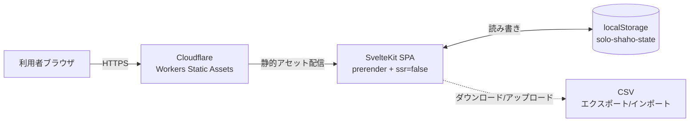
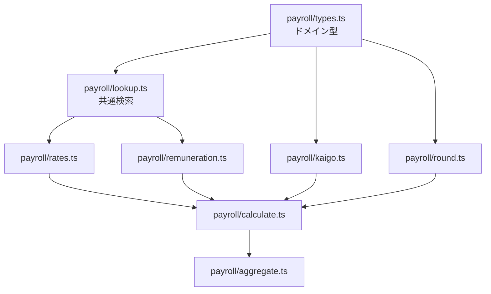

# ドキュメント 3 部構成への再編 設計仕様書

- **作成日**: 2026-04-26
- **対象**: `solo-shaho/docs/` 全体の構造再編 + Sphinx 設定刷新
- **ステータス**: 設計承認待ち

## 0. 背景と目的

`docs/` は現在 11 ファイルがフラットに配置されており、Excel ブック仕様が中心の構成になっている。Web アプリの開発が始まり、`docs/superpowers/specs/` と `docs/superpowers/plans/` 配下に開発資料(spec / 実装計画)が追加された結果、3 系統(Web アプリ / 計算リファレンス / Excel)の情報が物理境界なしに混在している。

本タスクで:

1. `docs/` を **Web アプリケーション / 社会保険料計算リファレンス / Excel 作成(オマケ)** の 3 部に物理ディレクトリで分割
2. `docs/superpowers/` は `/brainstorming` `/writing-plans` 等のスキル作業領域として温存し、Sphinx ビルドの入力からは除外する
3. Sphinx テーマを `furo` から `shibuya` に置換
4. 数式表現を MyST の `dollarmath` + `amsmath` で正式サポート
5. Mermaid 図描画ライブラリ `sphinx-oceanid` を導入し、Web 部とリファレンス部に各 1 枚の構成図を追加

## 1. ディレクトリ構造

```
docs/
├── conf.py
├── index.md                           # 3 部の入口・全体ナビ
├── web/                               # 第 1 部: Web アプリケーション
│   ├── index.md                       # 新規: アプリ概要 + Mermaid 構成図
│   ├── quickstart.md                  # 新規
│   ├── usage.md                       # 新規
│   ├── csv.md                         # 新規
│   └── architecture.md                # 新規: モジュール構成 Mermaid + 責務表(2026-04-26 追加)
├── reference/                         # 第 2 部: 計算のしくみ・リファレンス
│   ├── index.md                       # 新規: リファレンス入口(Web 実装非依存・概念目次のみ)
│   ├── logic.md
│   ├── rates.md
│   ├── semantics.md
│   ├── accounting.md
│   └── sources.md                     # ← reference.md を改名
├── excel/                             # 第 3 部: Excel 作成(オマケ)
│   ├── index.md                       # ← overview.md を改名・移動
│   ├── sheets.md
│   ├── operation.md
│   └── limitations.md
└── superpowers/                       # スキル作業領域(ビルド対象外)
    ├── specs/                         # /brainstorming で生成
    └── plans/                         # /writing-plans で生成
```

### ファイル移動マッピング

| 現在のパス | 移動後 | 操作 |
|---|---|---|
| `docs/overview.md` | `docs/excel/index.md` | `git mv` + リネーム |
| `docs/sheets.md` | `docs/excel/sheets.md` | `git mv` |
| `docs/operation.md` | `docs/excel/operation.md` | `git mv` |
| `docs/limitations.md` | `docs/excel/limitations.md` | `git mv` |
| `docs/logic.md` | `docs/reference/logic.md` | `git mv` |
| `docs/rates.md` | `docs/reference/rates.md` | `git mv` |
| `docs/semantics.md` | `docs/reference/semantics.md` | `git mv` |
| `docs/accounting.md` | `docs/reference/accounting.md` | `git mv` |
| `docs/reference.md` | `docs/reference/sources.md` | `git mv` + リネーム |

`docs/superpowers/` 配下のファイルは現位置のまま温存し、`exclude_patterns` で Sphinx ビルドから除外する(セクション 2 参照)。

### `index.md` の toctree 構造

```markdown
```{toctree}
:maxdepth: 2
:caption: Web アプリケーション

web/index
web/quickstart
web/usage
web/csv
```

```{toctree}
:maxdepth: 2
:caption: 社会保険料計算 — リファレンス

reference/index
reference/logic
reference/rates
reference/semantics
reference/accounting
reference/sources
```

```{toctree}
:maxdepth: 2
:caption: Excel 作成(オマケ)

excel/index
excel/sheets
excel/operation
excel/limitations
```
```

## 2. Sphinx 設定

`docs/conf.py`:

```python
"""Sphinx 設定ファイル."""

project = "solo-shaho"
author = "driller"
copyright = "2026, driller"
release = "0.1.0"

extensions = [
    "myst_parser",
    "sphinx_oceanid",
]

myst_enable_extensions = [
    "colon_fence",
    "deflist",
    "tasklist",
    "attrs_inline",
    "dollarmath",
    "amsmath",
]

myst_heading_anchors = 3

source_suffix = {".md": "markdown"}

language = "ja"
exclude_patterns = [
    "_build",
    "Thumbs.db",
    ".DS_Store",
    "superpowers",  # /brainstorming /writing-plans の作業領域はビルド対象外
]

html_theme = "shibuya"
html_static_path = ["_static"]
html_title = "solo-shaho ドキュメント"

myst_url_schemes = ("http", "https", "mailto", "ftp")
```

**変更点(差分):**

- `extensions` に `sphinx_oceanid` を追加
- `myst_enable_extensions` に `dollarmath`, `amsmath` を追加
- `exclude_patterns` に `superpowers` を追加(`/brainstorming` `/writing-plans` の作業領域は本番ドキュメントに含めない)
- `html_theme`: `furo` → `shibuya`

shibuya のサイドバー・ナビ等のオプションは初版ではデフォルトのまま。必要が出てから追加する。

## 3. 依存パッケージ

`pyproject.toml`:

```toml
[project]
requires-python = ">=3.13"

[dependency-groups]
docs = [
    "sphinx>=9.1",
    "myst-parser>=5",
    "shibuya>=2026.1.9",
    "sphinx-oceanid>=0.1.2",
    "sphinx-autobuild>=2024.10.3",
]
```

**変更点:**

- `requires-python`: `>=3.10` → `>=3.13`(sphinx-oceanid 要件 + プロジェクト方針整合)
- `furo>=2024` を削除
- `shibuya>=2026.1.9`、`sphinx-oceanid>=0.1.2` を追加
- `sphinx-autobuild` を追加(`make -C docs livehtml` 用)
- `sphinx`、`myst-parser` は最新バージョンに合わせて下限引き上げ

`uv.lock` 再生成は `uv lock --upgrade-package shibuya --upgrade-package sphinx-oceanid` ではなく `uv sync --group docs` 実行で再構成。

## 4. Mermaid 構成図の追加

### 4.1 `docs/web/index.md` — Web アプリ全体構成



### 4.2 `docs/web/architecture.md` — 計算エンジン モジュール依存

```{note}
2026-04-26 改訂: 本図は当初 `docs/reference/index.md` に置く設計だったが、レビューで「モジュール構成は Web 実装詳細であり、計算リファレンス(Excel/Web 共通)とは層が違う」との指摘により、Web 部 (`docs/web/architecture.md`) へ移設した。
```




両図とも `flowchart` 型のため sphinx-oceanid のサポート対象内。

## 5. 新規執筆ページ(Web 部 4 ファイル)

本タスクでは **プレースホルダ + 構成図** のみ作成し、本文は別タスクで充実させる。各ファイルの初期内容:

### 5.1 `docs/web/index.md`

- 1 段落の概要(`給与計算.xlsx` を Web 化したもの、ブラウザ完結、無料運用)
- 4.1 の Mermaid 図
- このセクションのページ一覧へのリンク
- 主要特長の箇条書き(プライバシー・コスト・可搬性)

### 5.2 `docs/web/quickstart.md`

- 配信 URL を開く
- 設定タブで生年月日・標準報酬月額・給与額面を入力
- 月次タブで対象年月を選択して計算結果を確認
- (上記をプレースホルダ見出しのみで配置。スクリーンショットは後日)

### 5.3 `docs/web/usage.md`

- 設定タブ / 月次タブ / 履歴タブ / I/O メニューの 4 セクション(見出しのみ)

### 5.4 `docs/web/csv.md`

- spec 第 5 章「CSV スキーマ」へのリンクと要約のみ
  - エクスポート形式概要
  - schemaVersion ポリシー
  - Formula Injection 対策が施されていること

## 6. 数式 math 化の範囲

`dollarmath` + `amsmath` は導入するが、本タスクで実際に書き換えるのは以下 2 ファイルのみ:

- `docs/excel/index.md`(現 `overview.md`)— 残額方式の式を `{math}` ブロックに統一
- `docs/reference/logic.md` — 既存の式を `{math}` ブロックまたは `$...$` インラインに変換

他のファイル(`rates.md` / `semantics.md` 等)は数式がほぼ無いため対象外。

```{note}
2026-04-26 改訂: 計算リファレンス層は **Excel/Web 双方の実装に共通する規範のみ** を述べる方針に整理。`reference/logic.md` から Excel 関数(`INT`/`MOD`/`IF`/`EOMONTH`/`XLOOKUP`)とセル参照を全削除し、MyST math 式と概念表現に置き換えた。Excel 関数の集約ファイルは作らない(復活させない)。詳細は `docs/superpowers/plans/2026-04-26-reference-generalization.md` を参照。
```

## 7. 既存文書の整合性更新

ファイル移動・改名に伴い、既存ドキュメント内の相互リンクが壊れる。以下を grep で洗い出して修正する:

- `(overview.md)` → `(../excel/index.md)`(参照元の階層に応じて)
- `(sheets.md)` `(operation.md)` `(limitations.md)` → `excel/...`
- `(logic.md)` `(rates.md)` `(semantics.md)` `(accounting.md)` → `reference/...`
- `(reference.md)` → `(reference/sources.md)`
- `{ref}\`...\`` 形式のラベル参照は変更不要(ラベルは保持される)

`README.md` 内の docs リンクも併せて修正。

## 8. ビルド検証

成功条件:

1. `uv sync --group docs` が成功
2. `uv run --group docs sphinx-build -W --keep-going docs docs/_build/html` が **warning ゼロ** で完了
3. ブラウザで `docs/_build/html/index.html` を開き:
   - shibuya テーマが適用されている
   - Mermaid 図 2 枚が SVG 描画されている
   - 数式が MathJax(または KaTeX)でレンダリングされている
   - 4 つの toctree キャプションが正しく分かれて表示されている

## 8.5. ローカルプレビュー (`make` ターゲット)

`sphinx-oceanid` は ES module による Mermaid 描画のため、`file://` プロトコルでは図が描画されない([CORS 制約](https://github.com/drillan/sphinx-oceanid/blob/main/docs/install.md))。HTTP サーバ経由で閲覧する `make serve` と、ファイル変更を監視する `make livehtml` を `docs/Makefile` に追加する。

```makefile
# docs/Makefile (差分のみ)

SPHINXBUILD   ?= uv run --group docs sphinx-build
SPHINXAUTOBUILD ?= uv run --group docs sphinx-autobuild
PORT          ?= 8000

.PHONY: help clean html serve livehtml

serve: html
	@echo "Serving at http://localhost:$(PORT) — press Ctrl+C to stop"
	uv run python -m http.server -d $(BUILDDIR)/html $(PORT)

livehtml:
	$(SPHINXAUTOBUILD) "$(SOURCEDIR)" "$(BUILDDIR)/html" $(SPHINXOPTS) $(O)
```

**設計判断:**

- `SPHINXBUILD` を `uv run --group docs sphinx-build` に変更し、シェルで venv をアクティベートしなくても `make -C docs html` が動作するようにする(本プロジェクトは uv 管理のため)
- `make serve`(依存最小)と `make livehtml`(自動再ビルド + ライブリロード)の 2 通りを提供
- `PORT` 変数で `make serve PORT=9000` のようにポート指定可能

**受け入れ基準:**

- `make -C docs livehtml` が起動し、ブラウザで `http://127.0.0.1:8000` を開くと shibuya テーマの HTML が表示される
- `.md` ファイルを編集すると数秒以内に自動再ビルド + ブラウザ自動リロードされる

## 9. スコープ外

- 新規 4 ページの本文充実(本タスクではプレースホルダのみ)
- スクリーンショット差し込み
- shibuya テーマのカスタマイズ(色・ロゴ・サイドバー設定)
- 検索・全文インデックスの最適化
- 多言語対応
- README.md の Web アプリ向け書き換え(リンク修正のみ実施)

## 10. 受け入れ基準

- [ ] `docs/web/`, `docs/reference/`, `docs/excel/` の 3 ディレクトリが存在
- [ ] 既存 9 ファイル(`overview` `sheets` `operation` `limitations` `logic` `rates` `semantics` `accounting` `reference`)が `git mv` で移動済み(履歴温存確認)
- [ ] `docs/superpowers/` は現位置のまま温存され、`docs/conf.py` の `exclude_patterns` に追加されている
- [ ] `docs/web/{index,quickstart,usage,csv}.md` が新規作成
- [ ] `docs/reference/index.md` が新規作成(モジュール依存図入り)
- [ ] `docs/web/index.md` に Mermaid 構成図が含まれる
- [ ] `pyproject.toml` の `requires-python` が `>=3.13`、`docs` グループから `furo` 削除・`shibuya` `sphinx-oceanid` 追加
- [ ] `docs/conf.py` のテーマが `shibuya`、extensions に `sphinx_oceanid`
- [ ] `uv run --group docs sphinx-build -W --keep-going docs docs/_build/html` が warning ゼロで成功(`docs/superpowers/` 配下のファイルがビルド出力に含まれないことを確認)
- [ ] `make -C docs html` および `make -C docs livehtml` が動作する
- [ ] 既存ドキュメント間の相互リンクが破綻していない
- [ ] `README.md` の docs リンクが新パスに更新されている
